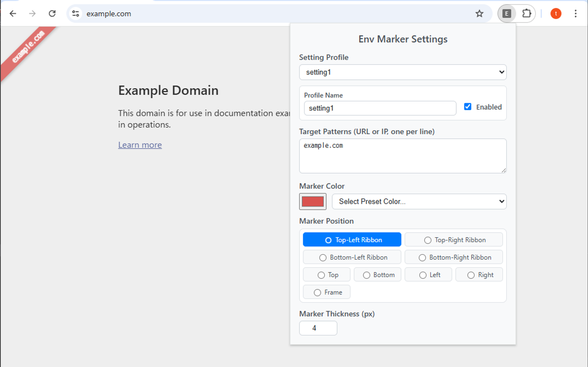

# Env Marker


指定したURLやIPアドレスのサイトを開いたときに、視覚的に識別しやすくするためのChrome拡張機能です。

## 主な機能

- **複数の設定プロファイル**: 最大5つの設定プロファイルを作成し、それぞれ個別に有効/無効を切り替え可能
- **URLパターンマッチング**: ワイルドカード（`*`）を使った柔軟なURL/IPアドレスのパターン指定
- **視覚的なマーカー表示**: 
  - ページ上部/下部/左右の帯、または枠線表示
  - リボンスタイル（4つの角に斜めリボン）
  - カスタマイズ可能な色と太さ
- **タイトルバー表示**: マッチしたページのタイトルにプレフィックスを追加
- **ファビコン変更**: 設定した色の円形アイコンに変更
- **IPアドレス監視**: webRequest APIを使用して接続先IPアドレスもチェック（バックグラウンドで動作）

## Target Patterns の仕様

Target Patterns には、URL または IPアドレスのパターンを1行に1つずつ記述します。

### パターンの書き方

- **マッチング方式**: **部分一致** - パターンがURLの一部に含まれていればマッチします
- **ワイルドカード `*`**: 任意の文字列にマッチ（オプション。部分一致なので多くの場合は不要）
- **特殊文字の自動エスケープ**: `.`、`+`、`?` などの正規表現特殊文字は自動的にエスケープされます
- **大文字小文字**: 区別されません

### パターンの例

```
# シンプルな部分一致（推奨）
example.com              # example.comを含む任意のURL
192.168.1                # 192.168.1を含む任意のURL/IP
localhost                # localhostを含む任意のURL
staging.mysite           # staging.mysiteを含む任意のURL

# ワイルドカードを使う場合（特定の文字の間に任意の文字列を許可したい場合）
192.168.*.100            # 192.168.0.100、192.168.1.100 などにマッチ
api.*.example.com        # api.dev.example.com、api.staging.example.com などにマッチ

# より具体的な指定
https://example.com      # HTTPSのexample.comのみ
localhost:3000           # ポート3000を指定
/admin                   # /adminを含むパス

# IPv6アドレス（圧縮表記と完全表記の両方に対応）
::1                      # IPv6ローカルホスト（圧縮表記）
fe80::1                  # リンクローカルアドレス（圧縮表記）
2001:db8::1              # 圧縮表記のIPv6アドレス
2001:0db8:85a3:0000:0000:8a2e:0370:7334  # 完全表記のIPv6アドレス
[::1]                    # URLに含まれるIPv6アドレス（ブラケット付き）
```

### マッチング対象

- **content.ts**: ページのURL全体（`location.href`）に対してパターンマッチング
- **background.ts**: webRequest APIで取得した接続先IPアドレス（IPv4/IPv6）にもパターンマッチング

**IPv6対応について**: IPv6アドレスは圧縮表記（`::`を使った短縮形）と完全表記の両方をサポートしています。パターンを圧縮表記で書いても、完全表記のIPv6アドレスに正しくマッチします（逆も同様）。

空行は無視されます。

## 使い方

1. **インストール**
   - Chrome拡張のデベロッパーモードでこのフォルダを読み込む（`.output/chrome-mv3-dev`フォルダを指定）
   
2. **設定**
   - 拡張機能のアイコンをクリックして設定画面を開く
   - Setting Profile から設定プロファイルを選択（setting1～5）
   - Profile Name で識別しやすい名前を付ける
   - "Enabled" チェックボックスでプロファイルを有効化
   - Target Patterns に監視したいURLやIPアドレスのパターンを入力（1行に1つ）
   - Marker Color で表示色を選択
   - Marker Position でマーカーの表示位置を選択（Top、Bottom、Left、Right、Frame、またはリボン）
   - Marker Thickness でマーカーの太さを設定（1～50px）

3. **動作**
   - 設定したパターンにマッチするサイトにアクセスすると、自動的にマーカーが表示されます
   - 複数のプロファイルが有効な場合、最初にマッチしたプロファイルの設定が適用されます
   - 設定を変更すると、開いているタブが自動的にリロードされ、変更が即座に反映されます

## 技術仕様

- **Manifest Version**: V3
- **必要な権限**: 
  - `storage`: 設定の保存
  - `tabs`: タブのリロード
  - `webRequest`: IPアドレスの取得
  - `<all_urls>`: すべてのページでの動作

注意: Manifest V3の制約により、タブツールバーそのものの色変更はできません。バナー、タイトル変更、ファビコン変更で代替しています。

## 開発者向けドキュメント

- [開発ガイド](DEVELOPMENT.md) - ローカル環境での開発方法
- [Chrome Web Store デプロイメント](CHROME_STORE_DEPLOYMENT.md) - 自動デプロイの設定方法
